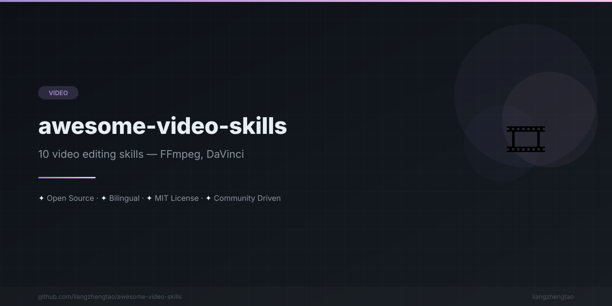

[English](README.md) | [中文](README.zh.md) | [日本語](README.ja.md) | [Français](README.fr.md) | [Español](README.es.md) | [العربية](README.ar.md) | [한국어](README.ko.md) | [Português](README.pt.md) | [Русский](README.ru.md) | [Deutsch](README.de.md)

<div align="center">



</div>


# 🎬 Awesome Video Skills

> Deja de buscar comandos de FFmpeg en Google. Escribe la habilidad una vez. Edita vídeos con IA para siempre.

<div align="center">

[](https://awesome.re)
[](CONTRIBUTING.md)
[](LICENSE)
[](#habilidades)

</div>

---


## El problema

Pasas **horas** buscando flags de FFmpeg, consultando atajos de DaVinci Resolve y reescribiendo los mismos scripts de subtítulos — en cada proyecto. Tu asistente de IA no conoce tu flujo de trabajo, tus preajustes ni tus preferencias.

## La solución

Escribe tus conocimientos de edición de vídeo como **habilidades de IA** una sola vez. Tu asistente de IA lee la habilidad y genera exactamente el pipeline, preajuste o script correcto — cada vez.

<div align="center">

| ❌ Sin habilidad | ✅ Con habilidad |
|:---:|:---:|
| 30 min buscando flags de FFmpeg | "Comprime este vídeo para YouTube" → comando perfecto |
| Redimensionar manualmente para 5 plataformas | Exportación batch con un clic para todas las plataformas |
| Reescribir scripts de subtítulos | La IA genera exactamente el pipeline de Whisper que quieres |
| Adivinar el SEO de YouTube | Optimización estructurada de título/descripción/etiquetas |

</div>

---

## Habilidades

### Edición de vídeo

| Habilidad | Descripción | Archivo |
|-----------|-------------|---------|
| 🎥 FFmpeg Master | Cortar, fusionar, convertir, comprimir — automatización completa del pipeline de FFmpeg | [`skills/视频剪辑/ffmpeg-master.md`](skills/视频剪辑/ffmpeg-master.md) |
| 🎨 DaVinci Resolve | Etalonaje, VFX de Fusion, audio de Fairlight, preajustes de entrega | [`skills/视频剪辑/davinci-resolve.md`](skills/视频剪辑/davinci-resolve.md) |
| 🎬 Premiere Pro | Configuración de secuencia, preajustes de exportación, Dynamic Link, Essential Graphics | [`skills/视频剪辑/premiere-pro.md`](skills/视频剪辑/premiere-pro.md) |

### Efectos especiales

| Habilidad | Descripción | Archivo |
|-----------|-------------|---------|
| ✨ Motion Graphics | Expresiones de After Effects, animaciones CSS, plantillas Lottie | [`skills/特效制作/motion-graphics.md`](skills/特效制作/motion-graphics.md) |
| 🤖 Generación de vídeo con IA | Prompt engineering y postprocesado para Runway, Pika, Sora | [`skills/特效制作/ai-video-generation.md`](skills/特效制作/ai-video-generation.md) |

### Subtítulos

| Habilidad | Descripción | Archivo |
|-----------|-------------|---------|
| 📝 Generación de subtítulos | Transcripción con Whisper, formato SRT/ASS, grabado de subtítulos | [`skills/字幕处理/subtitle-generation.md`](skills/字幕处理/subtitle-generation.md) |
| 🌐 Traducción de subtítulos | Pipelines multilingües, subtítulos bilingües, control de calidad | [`skills/字幕处理/translation-subtitles.md`](skills/字幕处理/translation-subtitles.md) |

### Audio

| Habilidad | Descripción | Archivo |
|-----------|-------------|---------|
| 🎵 Mezcla de audio | Eliminación de ruido, EQ, compresión, normalización, mezcla musical | [`skills/音频处理/audio-mixing.md`](skills/音频处理/audio-mixing.md) |

### Publicación

| Habilidad | Descripción | Archivo |
|-----------|-------------|---------|
| 📈 Optimización de YouTube | Títulos SEO, diseño de miniatura, etiquetas, analítica, programación de subida | [`skills/发布优化/youtube-optimization.md`](skills/发布优化/youtube-optimization.md) |
| 🌍 Publicación multiplataforma | YouTube, TikTok, Bilibili, Instagram — especificaciones, exportación batch, automatización | [`skills/发布优化/multi-platform-publish.md`](skills/发布优化/multi-platform-publish.md) |

---

## Inicio rápido

### Cursor

Copia cualquier archivo de habilidad al directorio `.cursorrules` o `.cursor/rules/` de tu proyecto:

```bash
cp skills/视频剪辑/ffmpeg-master.md .cursor/rules/ffmpeg.md
```

O referencia múltiples habilidades:

```bash
mkdir -p .cursor/rules
cp skills/**/*.md .cursor/rules/
```

### Claude Code

Añade las habilidades como contexto del proyecto en tu `CLAUDE.md`:

```markdown
## Video Skills
- @skills/视频剪辑/ffmpeg-master.md
- @skills/字幕处理/subtitle-generation.md
```

### Kimi Code

Copia los archivos de habilidades a la raíz de tu proyecto o al directorio `.kimi/`:

```bash
mkdir -p .kimi/skills
cp skills/**/*.md .kimi/skills/
```

### Usar las habilidades

Una vez instaladas, simplemente pregunta a tu asistente de IA de forma natural:

```
"Compress this video to under 50MB for email"
"Generate Chinese subtitles for this interview"
"Create a TikTok version of my YouTube video"
"Optimize my YouTube title and description for SEO"
"Mix background music under this voiceover at -18dB"
```

---

## Contribuir

¡Aceptamos nuevas habilidades de vídeo! Consulta [CONTRIBUTING.md](CONTRIBUTING.md) para las directrices.

Cómo contribuir:
1. Haz fork de este repositorio
2. Añade tu habilidad en la categoría apropiada bajo `skills/`
3. Sigue el formato de plantilla de habilidad (Cuándo usarla, Instrucciones, Plantillas, Errores comunes)
4. Envía un PR

---

## Ver también

- [awesome-skills](https://github.com/liangzhengtao/awesome-skills) — Colección seleccionada de habilidades de IA para cada dominio
- [awesome-ai-rules](https://github.com/liangzhengtao/awesome-ai-rules) — Reglas y configuraciones para asistentes de IA de programación
- [vibe-check](https://github.com/liangzhengtao/vibe-check) — Validación y pruebas de calidad de habilidades de IA
- [commit-ai](https://github.com/liangzhengtao/commit-ai) — Generación de mensajes de commit de Git con IA
- [awesome-mcp-servers](https://github.com/liangzhengtao/awesome-mcp-servers) — Servidores Model Context Protocol para herramientas de IA

---

## Licencia

[MIT](LICENSE) © [liangzhengtao](https://github.com/liangzhengtao)

---
